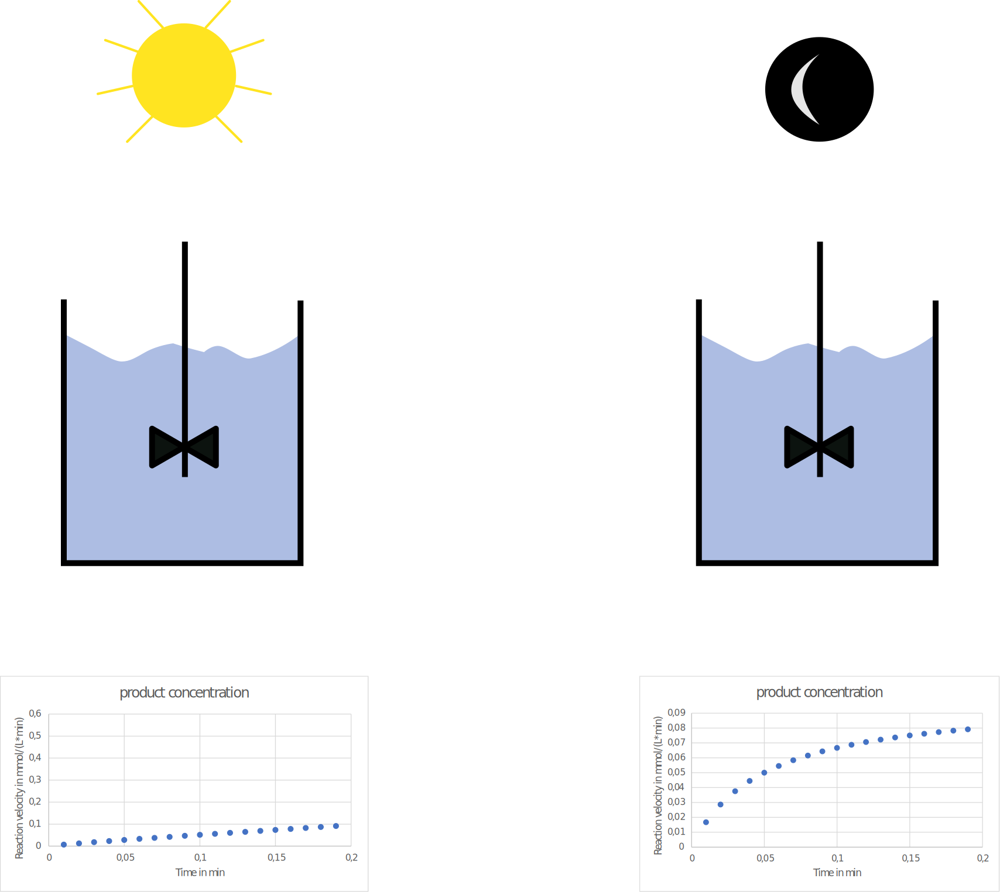

# What and Why?

Large number of datasets are produced in laboratories every day. With new devices and technologies, the number of available data has even massively increased. In many cases there is a large potential to extract knowledge from already collected data by comparing them with other already created data, or reanalysing them in a different manner or with different models. For example as [Rother and Gerlach](https://chemistry-europe.onlinelibrary.wiley.com/doi/full/10.1002/cctc.202100163) discovered are PLP-dependent (Pyridoxal 5’-phosphate) enzymes influenced by illumination. This would mean that experiments conducted in an illuminated environment are influenced differently by light than experiments performed in the dark. With this there is now large potential in optimising reactions with plp dependent enzymes. Maybe experimenters thougt that the experiments simply didn't work, but instead the enzymes were light sensitive.  



Now there would be the great potential to reanalyse reactions of plp-dependent enzymes and categorise them in light sensitive and not light senitive, which would have a great benefit for experimenters in the future.

Nevertheless, to be able to use this potential the data has to be collected, stored and published in a way that it can be retrieved and integrated with other data, which very often is not the case. Up until now, this is unfortunately not the case. The FAIR data principles provide guidelines how to improve the documentation, digitalisation and publishing of data. One of the principles is **R1.3**:

```
(Meta)-data meet domain relevant community standards

```

This again means that there should be a list, guideline or standard which tells experimenters which information they should collect to describe the experiments as best as possible. And exactly this is Strenda-biocatalysis. A standard in which experts fropm the biocatalysis community have provided their knowlegde to build a common ground and help other experimenters to describe their experiments as comprehensive and complete as possible. So that if someone discovers other enzymes influenced by light, the biocatalysis community will be able to access a large number of datasets, integrate them and improve the experimental design for the future. 